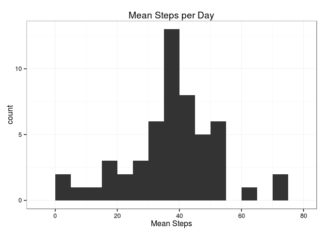

# Reproducible Research: Peer Assessment 1

```r
library(ggplot2)
theme_set(theme_bw())
```
## Loading and preprocessing the data

```r
setwd("D:/Users/Martin/Dropbox/Classes/data_science/Reproducible_Research/PeerAssessment1/")
unzip("activity.zip")
inputFile <- "activity.csv"

#Read in the csv data
colClasses <- c("numeric", "character", "numeric")
activityData <- read.csv(inputFile, colClasses=colClasses)
activityData$date <- as.Date(activityData$date)
attach(activityData)
```

## What is mean total number of steps taken per day?

```r
dailySteps <- aggregate(steps~date, FUN=mean)
qplot(dailySteps[, 2], xlab = "Mean Steps", main="Mean Steps per Day", 
      binwidth = 5)
```

 

```r
# Mean Steps per Day:
mean(steps, na.rm = TRUE)
```

```
## [1] 37.3826
```

```r
# Median Steps per Day:
median(steps, na.rm = TRUE)
```

```
## [1] 0
```

## What is the average daily activity pattern?

```r
meanSteps <- aggregate(steps~interval, FUN=mean)
qplot(meanSteps$interval, meanSteps$steps, geom = "line", 
      xlab = "Five Minute Interval", ylab = "Number of Steps", 
      main = "Steps vs. 5-minute Interval") + geom_line(size=0.7)
```

 

```r
# The interval in which the most steps were taken on average:
meanSteps[which.max(meanSteps$steps), ][[1]]
```

```
## [1] 835
```


## Imputing missing values

```r
# How many NA values are in the dataset?
length(which(is.na(activityData$steps)))
```

```
## [1] 2304
```

```r
imputeActivity <- activityData

# Fill in missing "steps"" values with the mean value of that interval
for (i in 1:nrow(imputeActivity)){
    if (is.na(imputeActivity[i, ]$steps)){
        missingInterval <- imputeActivity[i, ]$interval
        intervalMean <- meanSteps$steps[meanSteps$interval == missingInterval]
        imputeActivity[i, ]$steps <- intervalMean
    }
}

# Histogram and mean, median for imputed dataset
detach(activityData); attach(imputeActivity)
dailySteps <- aggregate(steps~date, FUN=mean)
qplot(dailySteps[, 2], xlab = "Mean Steps", 
      main="Mean Steps per Day (Imputed Data)", binwidth = 5)
```

 

```r
# Imputed data mean
mean(steps)
```

```
## [1] 37.3826
```

```r
median(steps)
```

```
## [1] 0
```
There is no difference between the mean and median for the imputed data vs. the raw data. Since I have used the interval means to fill in missing data, the only impact is a shift in the counts of the histogram. Specifically in the bin which includes the daily mean of 37.38, since all days which previously had NA values now have a daily mean of 37.38.


## Are there differences in activity patterns between weekdays and weekends?


```r
# Create a "day" factor
wkdays <- c("Monday", "Tuesday", "Wednesday", "Thursday", "Friday")

for (i in 1:nrow(activityData)){
    if (weekdays(activityData$date[i]) %in% wkdays){
        activityData$day[i] <- "weekday"
    } else {
        activityData$day[i] <- "weekend"
    }
}
activityData$day <- as.factor(activityData$day)
detach(imputeActivity);attach(activityData)

#Subset data by day factor and calculate means.
weekdaySteps <- aggregate(steps ~ interval + day, FUN=mean)

# Panel plot of activity by weekday/weekend
ggplot(weekdaySteps, aes(interval, steps)) + 
    geom_line(size=0.7) + 
    facet_grid(day ~.) +
    ggtitle("Average Steps per interval")
```

 

